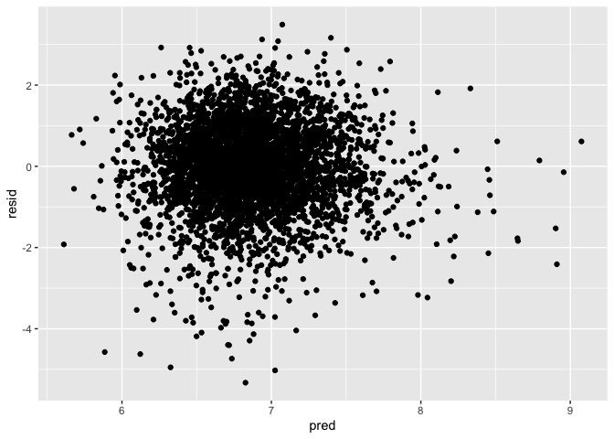
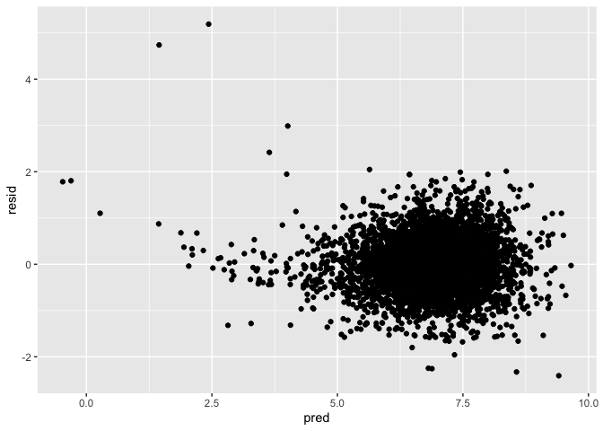

P8105 HW6
================
Yuchen Zheng
12/1/2021

``` r
library(tidyverse)
```

    ## ── Attaching packages ─────────────────────────────────────── tidyverse 1.3.1 ──

    ## ✓ ggplot2 3.3.5     ✓ purrr   0.3.4
    ## ✓ tibble  3.1.4     ✓ dplyr   1.0.7
    ## ✓ tidyr   1.1.3     ✓ stringr 1.4.0
    ## ✓ readr   2.0.1     ✓ forcats 0.5.1

    ## ── Conflicts ────────────────────────────────────────── tidyverse_conflicts() ──
    ## x dplyr::filter() masks stats::filter()
    ## x dplyr::lag()    masks stats::lag()

``` r
library(readr)
library(modelr)
```

## Problem 1

Load and clean data

``` r
bw_df = 
  read_csv("./data/birthweight.csv") %>% 
  mutate(babysex = factor(babysex),
         frace = factor(frace),
         malform = factor(malform),
         mrace = factor(mrace)) 
```

    ## Rows: 4342 Columns: 20

    ## ── Column specification ────────────────────────────────────────────────────────
    ## Delimiter: ","
    ## dbl (20): babysex, bhead, blength, bwt, delwt, fincome, frace, gaweeks, malf...

    ## 
    ## ℹ Use `spec()` to retrieve the full column specification for this data.
    ## ℹ Specify the column types or set `show_col_types = FALSE` to quiet this message.

``` r
bw_df %>% skimr::skim()
```

|                                                  |            |
|:-------------------------------------------------|:-----------|
| Name                                             | Piped data |
| Number of rows                                   | 4342       |
| Number of columns                                | 20         |
| \_\_\_\_\_\_\_\_\_\_\_\_\_\_\_\_\_\_\_\_\_\_\_   |            |
| Column type frequency:                           |            |
| factor                                           | 4          |
| numeric                                          | 16         |
| \_\_\_\_\_\_\_\_\_\_\_\_\_\_\_\_\_\_\_\_\_\_\_\_ |            |
| Group variables                                  | None       |

Data summary

**Variable type: factor**

| skim\_variable | n\_missing | complete\_rate | ordered | n\_unique | top\_counts                     |
|:---------------|-----------:|---------------:|:--------|----------:|:--------------------------------|
| babysex        |          0 |              1 | FALSE   |         2 | 1: 2230, 2: 2112                |
| frace          |          0 |              1 | FALSE   |         5 | 1: 2123, 2: 1911, 4: 248, 3: 46 |
| malform        |          0 |              1 | FALSE   |         2 | 0: 4327, 1: 15                  |
| mrace          |          0 |              1 | FALSE   |         4 | 1: 2147, 2: 1909, 4: 243, 3: 43 |

**Variable type: numeric**

| skim\_variable | n\_missing | complete\_rate |    mean |     sd |     p0 |     p25 |     p50 |     p75 |   p100 | hist  |
|:---------------|-----------:|---------------:|--------:|-------:|-------:|--------:|--------:|--------:|-------:|:------|
| bhead          |          0 |              1 |   33.65 |   1.62 |  21.00 |   33.00 |   34.00 |   35.00 |   41.0 | ▁▁▆▇▁ |
| blength        |          0 |              1 |   49.75 |   2.72 |  20.00 |   48.00 |   50.00 |   51.00 |   63.0 | ▁▁▁▇▁ |
| bwt            |          0 |              1 | 3114.40 | 512.15 | 595.00 | 2807.00 | 3132.50 | 3459.00 | 4791.0 | ▁▁▇▇▁ |
| delwt          |          0 |              1 |  145.57 |  22.21 |  86.00 |  131.00 |  143.00 |  157.00 |  334.0 | ▅▇▁▁▁ |
| fincome        |          0 |              1 |   44.11 |  25.98 |   0.00 |   25.00 |   35.00 |   65.00 |   96.0 | ▃▇▅▂▃ |
| gaweeks        |          0 |              1 |   39.43 |   3.15 |  17.70 |   38.30 |   39.90 |   41.10 |   51.3 | ▁▁▂▇▁ |
| menarche       |          0 |              1 |   12.51 |   1.48 |   0.00 |   12.00 |   12.00 |   13.00 |   19.0 | ▁▁▂▇▁ |
| mheight        |          0 |              1 |   63.49 |   2.66 |  48.00 |   62.00 |   63.00 |   65.00 |   77.0 | ▁▁▇▂▁ |
| momage         |          0 |              1 |   20.30 |   3.88 |  12.00 |   18.00 |   20.00 |   22.00 |   44.0 | ▅▇▂▁▁ |
| parity         |          0 |              1 |    0.00 |   0.10 |   0.00 |    0.00 |    0.00 |    0.00 |    6.0 | ▇▁▁▁▁ |
| pnumlbw        |          0 |              1 |    0.00 |   0.00 |   0.00 |    0.00 |    0.00 |    0.00 |    0.0 | ▁▁▇▁▁ |
| pnumsga        |          0 |              1 |    0.00 |   0.00 |   0.00 |    0.00 |    0.00 |    0.00 |    0.0 | ▁▁▇▁▁ |
| ppbmi          |          0 |              1 |   21.57 |   3.18 |  13.07 |   19.53 |   21.03 |   22.91 |   46.1 | ▃▇▁▁▁ |
| ppwt           |          0 |              1 |  123.49 |  20.16 |  70.00 |  110.00 |  120.00 |  134.00 |  287.0 | ▅▇▁▁▁ |
| smoken         |          0 |              1 |    4.15 |   7.41 |   0.00 |    0.00 |    0.00 |    5.00 |   60.0 | ▇▁▁▁▁ |
| wtgain         |          0 |              1 |   22.08 |  10.94 | -46.00 |   15.00 |   22.00 |   28.00 |   89.0 | ▁▁▇▁▁ |

I want to see if there is a relationship between mother’s pre-pregnancy
weight and baby’s birth weight and mother’s weight gain during pregnancy
and baby’s birth weight by plotting scatterplots.

``` r
bw_df %>% 
  select(bwt,wtgain, ppwt) %>% 
  pairs()
```

<!-- -->

``` r
bw_df %>% 
  ggplot(aes(x = wtgain, y = bwt)) +
  geom_point()
```

<!-- -->

``` r
bw_df %>% 
  ggplot(aes(x = ppwt, y = bwt)) +
  geom_point()
```

<!-- -->

``` r
bw_df %>% 
  ggplot(aes(x = delwt, y = bwt)) +
  geom_point()
```

<!-- -->

``` r
bw_df %>% 
  ggplot(aes(x = mheight, y = bwt)) +
  geom_point()
```

<!-- -->

fit a model using mother’s pre-pregnancy weight and mother’s weight gain
during pregnancy

``` r
fit1 = lm(bwt ~ ppwt + wtgain + mheight, data  = bw_df)

fit1 %>% broom::tidy()
```

    ## # A tibble: 4 × 5
    ##   term        estimate std.error statistic  p.value
    ##   <chr>          <dbl>     <dbl>     <dbl>    <dbl>
    ## 1 (Intercept)   970.     178.         5.44 5.68e- 8
    ## 2 ppwt            3.89     0.404      9.62 1.11e-21
    ## 3 wtgain         11.8      0.674     17.6  6.96e-67
    ## 4 mheight        22.1      3.06       7.22 6.14e-13

``` r
bw_df %>% 
  modelr::add_residuals(fit1) %>% 
  ggplot(aes(x = resid)) +
  geom_density() 
```

<!-- -->

fit a model using length at birth and gestational age as predictors

``` r
fit2 = lm(bwt ~ blength + gaweeks, data = bw_df)

fit2 %>% broom::tidy()
```

    ## # A tibble: 3 × 5
    ##   term        estimate std.error statistic  p.value
    ##   <chr>          <dbl>     <dbl>     <dbl>    <dbl>
    ## 1 (Intercept)  -4348.      98.0      -44.4 0       
    ## 2 blength        129.       1.99      64.6 0       
    ## 3 gaweeks         27.0      1.72      15.7 2.36e-54

``` r
bw_df %>% 
  modelr::add_residuals(fit2) %>% 
  ggplot(aes(x = resid)) +
  geom_density() 
```

<!-- -->

fit a model using head circumference, length, sex and all interactions

``` r
fit3 = lm(bwt ~ bhead + blength + babysex + bhead*blength + bhead*babysex + blength*babysex + bhead*blength*babysex, data = bw_df)

fit3 %>% broom::tidy()
```

    ## # A tibble: 8 × 5
    ##   term                    estimate std.error statistic      p.value
    ##   <chr>                      <dbl>     <dbl>     <dbl>        <dbl>
    ## 1 (Intercept)            -7177.     1265.       -5.67  0.0000000149
    ## 2 bhead                    182.       38.1       4.78  0.00000184  
    ## 3 blength                  102.       26.2       3.90  0.0000992   
    ## 4 babysex2                6375.     1678.        3.80  0.000147    
    ## 5 bhead:blength             -0.554     0.780    -0.710 0.478       
    ## 6 bhead:babysex2          -198.       51.1      -3.88  0.000105    
    ## 7 blength:babysex2        -124.       35.1      -3.52  0.000429    
    ## 8 bhead:blength:babysex2     3.88      1.06      3.67  0.000245

``` r
bw_df %>% 
  modelr::add_residuals(fit3) %>% 
  ggplot(aes(x = resid)) +
  geom_density() 
```

<!-- -->

``` r
cv_df = 
  crossv_mc(bw_df, 100) %>% 
  mutate(
    train = map(train, as_tibble),
    test = map(test, as_tibble)
  )

cv_fit_df=
  cv_df %>% 
  mutate(
    fit1 = map(.x = train, ~lm(bwt ~ ppwt + wtgain + mheight, data  = .x)),
    fit2 = map(.x = train, ~lm(bwt ~ blength + gaweeks, data = .x)),
    fit3 = map(.x = train, ~lm(bwt ~ bhead + blength + babysex + bhead*blength + bhead*babysex + blength*babysex + bhead*blength*babysex, data = .x))
  ) %>% 
  mutate(
    rmse_fit1 = map2_dbl(.x = fit1, .y = test, ~rmse(model = .x, data = .y)),
    rmse_fit2 = map2_dbl(.x = fit2, .y = test, ~rmse(model = .x, data = .y)),
    rmse_fit3 = map2_dbl(.x = fit3, .y = test, ~rmse(model = .x, data = .y)),
  )

cv_fit_df %>% 
  select(starts_with("rmse")) %>% 
  pivot_longer(
    everything(),
    names_to = "model",
    values_to = "rmse",
    names_prefix = "rmse"
  ) %>% 
  ggplot(aes(x = model, y = rmse)) +
  geom_boxplot()
```

<!-- -->

## Problem 2
