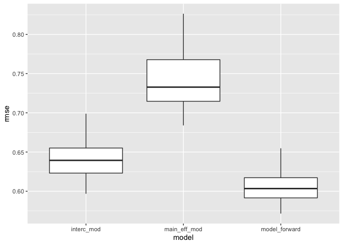

P8105 HW6
================
Yuchen Zheng
12/1/2021

``` r
library(tidyverse)
library(readr)
library(modelr)
library(patchwork)
```

## Problem 1

Load and clean data

``` r
bw_df = 
  read_csv("./data/birthweight.csv") %>% 
  mutate(babysex = factor(babysex),
         frace = factor(frace),
         malform = factor(malform),
         mrace = factor(mrace)) %>% 
  mutate(bwt = bwt*0.00220462)

bw_df %>% skimr::skim()
```

|                                                  |            |
|:-------------------------------------------------|:-----------|
| Name                                             | Piped data |
| Number of rows                                   | 4342       |
| Number of columns                                | 20         |
| \_\_\_\_\_\_\_\_\_\_\_\_\_\_\_\_\_\_\_\_\_\_\_   |            |
| Column type frequency:                           |            |
| factor                                           | 4          |
| numeric                                          | 16         |
| \_\_\_\_\_\_\_\_\_\_\_\_\_\_\_\_\_\_\_\_\_\_\_\_ |            |
| Group variables                                  | None       |

Data summary

**Variable type: factor**

| skim\_variable | n\_missing | complete\_rate | ordered | n\_unique | top\_counts                     |
|:---------------|-----------:|---------------:|:--------|----------:|:--------------------------------|
| babysex        |          0 |              1 | FALSE   |         2 | 1: 2230, 2: 2112                |
| frace          |          0 |              1 | FALSE   |         5 | 1: 2123, 2: 1911, 4: 248, 3: 46 |
| malform        |          0 |              1 | FALSE   |         2 | 0: 4327, 1: 15                  |
| mrace          |          0 |              1 | FALSE   |         4 | 1: 2147, 2: 1909, 4: 243, 3: 43 |

**Variable type: numeric**

| skim\_variable | n\_missing | complete\_rate |   mean |    sd |     p0 |    p25 |    p50 |    p75 |   p100 | hist  |
|:---------------|-----------:|---------------:|-------:|------:|-------:|-------:|-------:|-------:|-------:|:------|
| bhead          |          0 |              1 |  33.65 |  1.62 |  21.00 |  33.00 |  34.00 |  35.00 |  41.00 | ▁▁▆▇▁ |
| blength        |          0 |              1 |  49.75 |  2.72 |  20.00 |  48.00 |  50.00 |  51.00 |  63.00 | ▁▁▁▇▁ |
| bwt            |          0 |              1 |   6.87 |  1.13 |   1.31 |   6.19 |   6.91 |   7.63 |  10.56 | ▁▁▇▇▁ |
| delwt          |          0 |              1 | 145.57 | 22.21 |  86.00 | 131.00 | 143.00 | 157.00 | 334.00 | ▅▇▁▁▁ |
| fincome        |          0 |              1 |  44.11 | 25.98 |   0.00 |  25.00 |  35.00 |  65.00 |  96.00 | ▃▇▅▂▃ |
| gaweeks        |          0 |              1 |  39.43 |  3.15 |  17.70 |  38.30 |  39.90 |  41.10 |  51.30 | ▁▁▂▇▁ |
| menarche       |          0 |              1 |  12.51 |  1.48 |   0.00 |  12.00 |  12.00 |  13.00 |  19.00 | ▁▁▂▇▁ |
| mheight        |          0 |              1 |  63.49 |  2.66 |  48.00 |  62.00 |  63.00 |  65.00 |  77.00 | ▁▁▇▂▁ |
| momage         |          0 |              1 |  20.30 |  3.88 |  12.00 |  18.00 |  20.00 |  22.00 |  44.00 | ▅▇▂▁▁ |
| parity         |          0 |              1 |   0.00 |  0.10 |   0.00 |   0.00 |   0.00 |   0.00 |   6.00 | ▇▁▁▁▁ |
| pnumlbw        |          0 |              1 |   0.00 |  0.00 |   0.00 |   0.00 |   0.00 |   0.00 |   0.00 | ▁▁▇▁▁ |
| pnumsga        |          0 |              1 |   0.00 |  0.00 |   0.00 |   0.00 |   0.00 |   0.00 |   0.00 | ▁▁▇▁▁ |
| ppbmi          |          0 |              1 |  21.57 |  3.18 |  13.07 |  19.53 |  21.03 |  22.91 |  46.10 | ▃▇▁▁▁ |
| ppwt           |          0 |              1 | 123.49 | 20.16 |  70.00 | 110.00 | 120.00 | 134.00 | 287.00 | ▅▇▁▁▁ |
| smoken         |          0 |              1 |   4.15 |  7.41 |   0.00 |   0.00 |   0.00 |   5.00 |  60.00 | ▇▁▁▁▁ |
| wtgain         |          0 |              1 |  22.08 | 10.94 | -46.00 |  15.00 |  22.00 |  28.00 |  89.00 | ▁▁▇▁▁ |

There is no missing values in this dataset. There are four categorical
variables: babysex, frace, marace and malform. The rest of the variables
are numeric variables.

I made a few plots to see the relationships between the response
variable baby’s birth weight and some numeric variables in the dataset.

``` r
p1 = 
  bw_df %>% 
  ggplot(aes(x = bhead, y = bwt)) +
  geom_point()

p2 = 
  bw_df %>% 
  ggplot(aes(x = blength, y = bwt)) +
  geom_point()

p3 = 
  bw_df %>% 
  ggplot(aes(x = wtgain, y = bwt)) +
  geom_point()

p4 = 
  bw_df %>% 
  ggplot(aes(x = ppwt, y = bwt)) +
  geom_point()

p5 =
  bw_df %>% 
  ggplot(aes(x = delwt, y = bwt)) +
  geom_point()

p6 =
  bw_df %>% 
  ggplot(aes(x = mheight, y = bwt)) +
  geom_point()

p1 + p2 + p3 + p4 + p5 + p6
```

<!-- -->

From this plot, we can see that there could be a linear relationship
between varaible bhead and bwt and between blength and bwt. For other
variables, wtgain, ppwt, delwt and mheight, there are no visible linear
relationships between the each of them and the response variable.

I also made four boxplots to see the distributions of baby’s birth
weight by the four categorical variables.

``` r
p5 = 
  bw_df %>% 
  ggplot(aes(x = babysex, y = bwt)) +
  geom_boxplot()

p6 = 
  bw_df %>% 
  ggplot(aes(x = frace, y = bwt)) +
  geom_boxplot()

p7 = 
  bw_df %>% 
  ggplot(aes(x = mrace, y = bwt)) +
  geom_boxplot()

p8 = 
  bw_df %>% 
  ggplot(aes(x = malform, y = bwt)) +
  geom_boxplot()

p5 + p6 + p7 + p8
```

<!-- -->

From these plots, we can see the distributions of baby’s birth weight
among different levels in each categorical seems to be similar.

Since from the plots, it’s not obvious which predictors have a linear
relationship with the response variable, I chose to perform a forward
stepwise model selection by AIC to fit my linear model.

``` r
full_model = ~bwt + babysex + bhead + blength + delwt + fincome + frace + gaweeks + malform + menarche + mheight + momage + mrace + parity + pnumlbw + pnumsga + ppbmi + ppwt + smoken + wtgain

base_model = lm(bwt ~ babysex, data = bw_df)

model_forward = step(base_model, full_model, direction = 'forward')
```

    ## Start:  AIC=1024.74
    ## bwt ~ babysex
    ## 
    ##            Df Sum of Sq    RSS      AIC
    ## + bhead     1   3056.37 2436.3 -2502.99
    ## + blength   1   3017.73 2475.0 -2434.66
    ## + gaweeks   1    948.65 4544.1   203.49
    ## + mrace     3    489.26 5003.4   625.65
    ## + frace     4    478.40 5014.3   637.07
    ## + delwt     1    454.28 5038.4   651.91
    ## + wtgain    1    331.24 5161.5   756.67
    ## + mheight   1    205.80 5286.9   860.93
    ## + ppwt      1    184.94 5307.8   878.03
    ## + fincome   1    128.96 5363.7   923.58
    ## + momage    1     97.37 5395.3   949.08
    ## + ppbmi     1     48.22 5444.5   988.46
    ## + smoken    1     33.72 5459.0  1000.00
    ## + menarche  1      3.45 5489.3  1024.01
    ## <none>                  5492.7  1024.74
    ## + parity    1      0.23 5492.5  1026.56
    ## + malform   1      0.00 5492.7  1026.74
    ## 
    ## Step:  AIC=-2502.99
    ## bwt ~ babysex + bhead
    ## 
    ##            Df Sum of Sq    RSS     AIC
    ## + blength   1    681.49 1754.8 -3925.7
    ## + mrace     3    130.19 2306.1 -2735.4
    ## + frace     4    121.11 2315.2 -2716.4
    ## + gaweeks   1    103.46 2332.9 -2689.4
    ## + delwt     1     93.50 2342.8 -2670.9
    ## + wtgain    1     69.68 2366.7 -2627.0
    ## + mheight   1     60.36 2376.0 -2609.9
    ## + ppwt      1     36.05 2400.3 -2565.7
    ## + fincome   1     26.14 2410.2 -2547.8
    ## + momage    1     17.44 2418.9 -2532.2
    ## + smoken    1      6.36 2430.0 -2512.3
    ## + ppbmi     1      4.68 2431.7 -2509.3
    ## + menarche  1      2.65 2433.7 -2505.7
    ## <none>                  2436.3 -2503.0
    ## + parity    1      0.19 2436.1 -2501.3
    ## + malform   1      0.00 2436.3 -2501.0
    ## 
    ## Step:  AIC=-3925.66
    ## bwt ~ babysex + bhead + blength
    ## 
    ##            Df Sum of Sq    RSS     AIC
    ## + mrace     3    82.902 1671.9 -4129.8
    ## + frace     4    77.536 1677.3 -4113.9
    ## + delwt     1    42.028 1712.8 -4028.9
    ## + gaweeks   1    34.292 1720.5 -4009.3
    ## + wtgain    1    33.501 1721.3 -4007.4
    ## + fincome   1    24.165 1730.7 -3983.9
    ## + mheight   1    23.712 1731.1 -3982.7
    ## + ppwt      1    15.182 1739.7 -3961.4
    ## + momage    1    14.205 1740.6 -3959.0
    ## + ppbmi     1     2.273 1752.6 -3929.3
    ## + smoken    1     2.128 1752.7 -3928.9
    ## + parity    1     1.210 1753.6 -3926.7
    ## + menarche  1     0.970 1753.9 -3926.1
    ## <none>                  1754.8 -3925.7
    ## + malform   1     0.124 1754.7 -3924.0
    ## 
    ## Step:  AIC=-4129.79
    ## bwt ~ babysex + bhead + blength + mrace
    ## 
    ##            Df Sum of Sq    RSS     AIC
    ## + delwt     1    45.769 1626.2 -4248.3
    ## + wtgain    1    36.201 1635.7 -4222.8
    ## + gaweeks   1    23.957 1648.0 -4190.5
    ## + smoken    1    16.995 1655.0 -4172.2
    ## + ppwt      1    16.312 1655.6 -4170.4
    ## + mheight   1    15.429 1656.5 -4168.0
    ## + ppbmi     1     4.900 1667.0 -4140.5
    ## + fincome   1     2.300 1669.6 -4133.8
    ## + parity    1     1.267 1670.7 -4131.1
    ## + menarche  1     1.080 1670.9 -4130.6
    ## + momage    1     0.867 1671.1 -4130.0
    ## <none>                  1671.9 -4129.8
    ## + malform   1     0.007 1671.9 -4127.8
    ## + frace     4     0.752 1671.2 -4123.7
    ## 
    ## Step:  AIC=-4248.31
    ## bwt ~ babysex + bhead + blength + mrace + delwt
    ## 
    ##            Df Sum of Sq    RSS     AIC
    ## + gaweeks   1   22.0327 1604.1 -4305.5
    ## + smoken    1   21.7792 1604.4 -4304.9
    ## + ppbmi     1   15.4670 1610.7 -4287.8
    ## + ppwt      1   13.3212 1612.8 -4282.0
    ## + wtgain    1   13.3212 1612.8 -4282.0
    ## + mheight   1    2.1453 1624.0 -4252.0
    ## + fincome   1    1.8239 1624.3 -4251.2
    ## + parity    1    1.2476 1624.9 -4249.6
    ## <none>                  1626.2 -4248.3
    ## + menarche  1    0.2687 1625.9 -4247.0
    ## + momage    1    0.1213 1626.0 -4246.6
    ## + malform   1    0.0000 1626.2 -4246.3
    ## + frace     4    0.5432 1625.6 -4241.8
    ## 
    ## Step:  AIC=-4305.54
    ## bwt ~ babysex + bhead + blength + mrace + delwt + gaweeks
    ## 
    ##            Df Sum of Sq    RSS     AIC
    ## + smoken    1   23.7803 1580.4 -4368.4
    ## + ppbmi     1   14.2767 1589.9 -4342.4
    ## + ppwt      1   11.1254 1593.0 -4333.8
    ## + wtgain    1   11.1254 1593.0 -4333.8
    ## + mheight   1    2.5626 1601.6 -4310.5
    ## + parity    1    2.2006 1601.9 -4309.5
    ## + fincome   1    1.4858 1602.7 -4307.6
    ## <none>                  1604.1 -4305.5
    ## + menarche  1    0.2993 1603.8 -4304.3
    ## + momage    1    0.0203 1604.1 -4303.6
    ## + malform   1    0.0006 1604.1 -4303.5
    ## + frace     4    0.4956 1603.6 -4298.9
    ## 
    ## Step:  AIC=-4368.39
    ## bwt ~ babysex + bhead + blength + mrace + delwt + gaweeks + smoken
    ## 
    ##            Df Sum of Sq    RSS     AIC
    ## + ppbmi     1   15.5939 1564.8 -4409.4
    ## + ppwt      1   11.7782 1568.6 -4398.9
    ## + wtgain    1   11.7782 1568.6 -4398.9
    ## + mheight   1    2.9473 1577.4 -4374.5
    ## + parity    1    2.1568 1578.2 -4372.3
    ## + fincome   1    1.1830 1579.2 -4369.6
    ## <none>                  1580.4 -4368.4
    ## + menarche  1    0.1925 1580.2 -4366.9
    ## + malform   1    0.0205 1580.3 -4366.4
    ## + momage    1    0.0073 1580.3 -4366.4
    ## + frace     4    0.7076 1579.7 -4362.3
    ## 
    ## Step:  AIC=-4409.44
    ## bwt ~ babysex + bhead + blength + mrace + delwt + gaweeks + smoken + 
    ##     ppbmi
    ## 
    ##            Df Sum of Sq    RSS     AIC
    ## + parity    1   2.04197 1562.7 -4413.1
    ## + ppwt      1   1.14916 1563.6 -4410.6
    ## + wtgain    1   1.14916 1563.6 -4410.6
    ## + fincome   1   0.97246 1563.8 -4410.1
    ## + mheight   1   0.83734 1563.9 -4409.8
    ## <none>                  1564.8 -4409.4
    ## + menarche  1   0.60438 1564.2 -4409.1
    ## + momage    1   0.17358 1564.6 -4407.9
    ## + malform   1   0.01045 1564.8 -4407.5
    ## + frace     4   0.62749 1564.1 -4403.2
    ## 
    ## Step:  AIC=-4413.11
    ## bwt ~ babysex + bhead + blength + mrace + delwt + gaweeks + smoken + 
    ##     ppbmi + parity
    ## 
    ##            Df Sum of Sq    RSS     AIC
    ## + ppwt      1   1.08070 1561.6 -4414.1
    ## + wtgain    1   1.08070 1561.6 -4414.1
    ## + fincome   1   1.03733 1561.7 -4414.0
    ## + mheight   1   0.77171 1562.0 -4413.3
    ## <none>                  1562.7 -4413.1
    ## + menarche  1   0.64799 1562.1 -4412.9
    ## + momage    1   0.10468 1562.6 -4411.4
    ## + malform   1   0.01098 1562.7 -4411.1
    ## + frace     4   0.62417 1562.1 -4406.8
    ## 
    ## Step:  AIC=-4414.12
    ## bwt ~ babysex + bhead + blength + mrace + delwt + gaweeks + smoken + 
    ##     ppbmi + parity + ppwt
    ## 
    ##            Df Sum of Sq    RSS     AIC
    ## + fincome   1   1.23228 1560.4 -4415.5
    ## <none>                  1561.6 -4414.1
    ## + menarche  1   0.50434 1561.1 -4413.5
    ## + mheight   1   0.39566 1561.2 -4413.2
    ## + momage    1   0.22535 1561.4 -4412.7
    ## + malform   1   0.00528 1561.6 -4412.1
    ## + frace     4   0.64488 1561.0 -4407.9
    ## 
    ## Step:  AIC=-4415.55
    ## bwt ~ babysex + bhead + blength + mrace + delwt + gaweeks + smoken + 
    ##     ppbmi + parity + ppwt + fincome
    ## 
    ##            Df Sum of Sq    RSS     AIC
    ## <none>                  1560.4 -4415.5
    ## + menarche  1   0.48133 1559.9 -4414.9
    ## + mheight   1   0.34603 1560.1 -4414.5
    ## + momage    1   0.06032 1560.3 -4413.7
    ## + malform   1   0.00843 1560.4 -4413.6
    ## + frace     4   0.63490 1559.8 -4409.3

``` r
model_forward
```

    ## 
    ## Call:
    ## lm(formula = bwt ~ babysex + bhead + blength + mrace + delwt + 
    ##     gaweeks + smoken + ppbmi + parity + ppwt + fincome, data = bw_df)
    ## 
    ## Coefficients:
    ## (Intercept)     babysex2        bhead      blength       mrace2       mrace3  
    ##  -12.529551     0.062957     0.288451     0.165299    -0.306067    -0.168320  
    ##      mrace4        delwt      gaweeks       smoken        ppbmi       parity  
    ##   -0.224381     0.009058     0.025531    -0.010680    -0.020331     0.211412  
    ##        ppwt      fincome  
    ##   -0.002354     0.000712

The model chosen by stepwise forward selection by AIC is: lm(formula =
bwt \~ babysex + bhead + blength + mrace + delwt + gaweeks + smoken +
ppbmi + parity + ppwt + fincome, data = bw\_df)

Next, I made a plot of model residuals against fitted values.

``` r
bw_df %>% 
  add_residuals(model_forward) %>% 
  add_predictions(model_forward) %>%  
  ggplot(aes(x = pred, y = resid)) +
  geom_point() 
```

<!-- -->

Fit a model using length at birth and gestational age as predictors

``` r
main_eff_mod = lm(bwt ~ blength + gaweeks, data = bw_df)

main_eff_mod %>% broom::tidy()
```

    ## # A tibble: 3 × 5
    ##   term        estimate std.error statistic  p.value
    ##   <chr>          <dbl>     <dbl>     <dbl>    <dbl>
    ## 1 (Intercept)  -9.58     0.216       -44.4 0       
    ## 2 blength       0.283    0.00439      64.6 0       
    ## 3 gaweeks       0.0596   0.00379      15.7 2.36e-54

Fit a model using head circumference, length, sex and all interactions

``` r
interc_mod = lm(bwt ~ bhead + blength + babysex + bhead*blength + bhead*babysex + blength*babysex + bhead*blength*babysex, data = bw_df)

interc_mod %>% broom::tidy()
```

    ## # A tibble: 8 × 5
    ##   term                    estimate std.error statistic      p.value
    ##   <chr>                      <dbl>     <dbl>     <dbl>        <dbl>
    ## 1 (Intercept)            -15.8       2.79       -5.67  0.0000000149
    ## 2 bhead                    0.401     0.0839      4.78  0.00000184  
    ## 3 blength                  0.225     0.0578      3.90  0.0000992   
    ## 4 babysex2                14.1       3.70        3.80  0.000147    
    ## 5 bhead:blength           -0.00122   0.00172    -0.710 0.478       
    ## 6 bhead:babysex2          -0.437     0.113      -3.88  0.000105    
    ## 7 blength:babysex2        -0.273     0.0774     -3.52  0.000429    
    ## 8 bhead:blength:babysex2   0.00855   0.00233     3.67  0.000245

Compare my model to a main effect model with length at birth and
gestational age as predictors and a model with head circumference,
length, sex, and all interactions as predictors.

``` r
cv_df = 
  crossv_mc(bw_df, 100) %>% 
  mutate(
    train = map(train, as_tibble),
    test = map(test, as_tibble)
  )

cv_fit_df=
  cv_df %>% 
  mutate(
    model_forward = map(.x = train, ~lm(bwt ~ babysex + bhead + blength + mrace + delwt + 
    gaweeks + smoken + ppbmi + parity + ppwt + fincome, data  = .x)),
    main_eff_mod = map(.x = train, ~lm(bwt ~ blength + gaweeks, data = .x)),
    interc_mod = map(.x = train, ~lm(bwt ~ bhead + blength + babysex + bhead*blength + bhead*babysex + blength*babysex + bhead*blength*babysex, data = .x))
  ) %>% 
  mutate(
    rmse_model_forward = map2_dbl(.x = model_forward, .y = test, ~rmse(model = .x, data = .y)),
    rmse_main_eff_mod = map2_dbl(.x = main_eff_mod, .y = test, ~rmse(model = .x, data = .y)),
    rmse_interc_mod = map2_dbl(.x = interc_mod, .y = test, ~rmse(model = .x, data = .y)),
  )

cv_fit_df %>% 
  select(starts_with("rmse")) %>% 
  pivot_longer(
    everything(),
    names_to = "model",
    values_to = "rmse",
    names_prefix = "rmse_"
  ) %>% 
  ggplot(aes(x = model, y = rmse)) +
  geom_boxplot()
```

<!-- -->

## Problem 2

Read the dataset

``` r
weather_df = 
  rnoaa::meteo_pull_monitors(
    c("USW00094728"),
    var = c("PRCP", "TMIN", "TMAX"), 
    date_min = "2017-01-01",
    date_max = "2017-12-31") %>%
  mutate(
    name = recode(id, USW00094728 = "CentralPark_NY"),
    tmin = tmin / 10,
    tmax = tmax / 10) %>%
  select(name,id, everything())
```

    ## Registered S3 method overwritten by 'hoardr':
    ##   method           from
    ##   print.cache_info httr

    ## using cached file: ~/Library/Caches/R/noaa_ghcnd/USW00094728.dly

    ## date created (size, mb): 2021-10-05 10:33:09 (7.602)

    ## file min/max dates: 1869-01-01 / 2021-10-31

Use 5000 bootstrap samples and for each sample produce estimates of
adjusted $\\hat{r^2}$ and log(*β̂*<sub>0</sub> \* *β̂*<sub>1</sub>)

``` r
weather_bootstrap_results = 
  weather_df %>% 
  select(tmax, tmin) %>% 
  bootstrap(n = 5000, id = "strap_number") %>%  #draw 10 samples with replacement have the same size as the filtered dataset
  mutate(
    models = map(.x = strap, ~lm(tmax ~ tmin, data = .x)),
    results_coeff = map(models, broom::tidy),
    results_rsquare = map(models, broom::glance)
  ) %>% 
  select(strap_number, results_coeff, results_rsquare) %>% 
  unnest(results_coeff) %>% 
  select(strap_number,term, estimate, results_rsquare) %>% 
  unnest(results_rsquare) %>% 
  select(strap_number, term, estimate, r.squared)
```

``` r
beta0_df = 
  weather_bootstrap_results %>% 
  filter(term == "(Intercept)") %>% 
  select(strap_number, estimate) %>% 
  rename(beta0 = estimate)


beta1_df = 
  weather_bootstrap_results %>% 
  filter(term == "tmin") %>%
  select(strap_number,estimate) %>% 
  rename(beta1 = estimate)

betas_df = 
  inner_join(beta0_df, beta1_df, by = "strap_number") %>% 
  mutate(log_beta = log(beta0*beta1))

betas_df %>% 
  ggplot(aes(log_beta)) +
  geom_density()
```

<!-- -->

The distribution of log(*β̂*<sub>0</sub> \* *β̂*<sub>1</sub>) seems to be
somewhat left-skewed.

``` r
quantile(betas_df$log_beta, c(.025, 0.975)) 
```

    ##     2.5%    97.5% 
    ## 1.965811 2.059462

The 95% confidence interal for log(*β̂*<sub>0</sub> \* *β̂*<sub>1</sub>)
is (1.96, 2.05).

``` r
rsquare_df = 
  weather_bootstrap_results %>% 
  select(strap_number, r.squared) %>% 
  distinct(strap_number, .keep_all = TRUE)

rsquare_df %>% 
  ggplot(aes(r.squared)) +
  geom_density()
```

<!-- -->

The distribution of $\\hat{r^2}$ seems to be somewhat left-skewed.

``` r
quantile(rsquare_df$r.squared, c(.025, 0.975)) 
```

    ##      2.5%     97.5% 
    ## 0.8936858 0.9272085

The 95% confidence interal for $\\hat{r^2}$ is (0.89, 0.92).
